# Runtime Modernization

## Table of Contents

- [Introduction](#introduction)
- [Analysis](#analysis) (Hands-on)
- [Build](#build) (Hands-on)
- [Deploy](#deploy) (Hands-on)
- [Access the Application](#access-the-application-hands-on) (Hands-on)
- [Review Deployment](#review-deployment)
- [Cleanup](#cleanup-hands-on) (can be skipped if the next lab Application Management is included in the same session)
- [Extra Credit](#extra-credit)
- [Summary](#summary)
- [Next](#next)

## Introduction

**Runtime modernization** moves an application to a 'built for the cloud' runtime with the least amount of effort. **Open Liberty** is a fast, dynamic, and easy-to-use Java application server. Ideal for the cloud, Liberty is open sourced, with fast start-up times (<2 seconds), no server restarts to pick up changes, and a simple XML configuration.

**This path gets the application on to a cloud-ready runtime container which is easy to use and portable. In addition to the necessary library changes, some aspects of the application were modernized. However, it has not been 'modernized' to a newer architecture such as micro-services**.

This lab demonstrates **runtime modernization**.
It uses the **Customer Order Services** application, which originates from WebSphere ND V8.5.5. 
Click [here](extras/application.md) to get to know the application, including its architecture and components.
The application will go through the **analysis**, **build** and **deploy** phases. 
It is modernized to run on the Liberty runtime, and
deployed via the IBM Cloud Pak for Applications to RedHat OpenShift Container Platform (OCP).

<a name="Login_VM"> </a>
## Login to the VM
1. If the VM is not already started, start it by clicking the Play button.
 
   
   
3. After the VM is started, click the **desktop** VM to access it.
   
   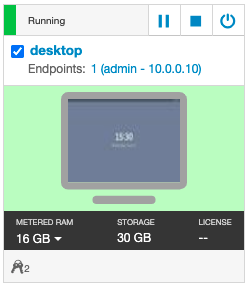
   
3. Login with **ibmuser** ID.
   * Click on the **ibmuser** icon on the Ubuntu screen.
   * When prompted for the password for **ibmuser**, enter "**engageibm**" as the password: \
     Password: **engageibm**
     
     
     
4. Resize the Skytap environment window for a larger viewing area while doing the lab. From the Skytap menu bar, click on the "**Fit to Size**" icon. This will enlarge the viewing area to fit the size of your browser window. 

   

<a name="analysis"></a>
## Analysis (Hands-on)

In this lab, we will demonstrate how the Transformation Advisor can be used specifically in the runtime modernization process.

The steps needed to analyze the existing Customer Order Services application are:

1. Open a Firefox browser window from within the VM. 
    

1. Click on the **openshift console** bookmark in the top left and log in with the **htpasswd** option.

    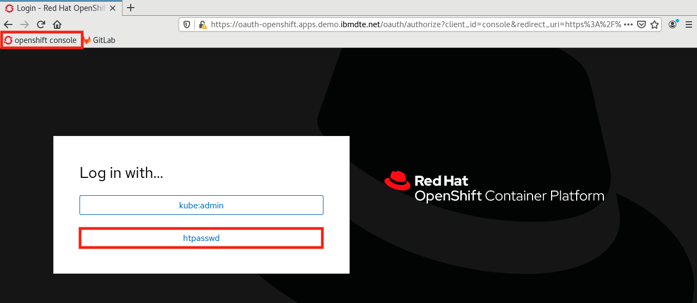

1. Log in to the OpenShift account using the following credentials:
    - Username: **ibmadmin**
    - Password: **engageibm**

    

1. From the Red Hat OpenShift Container Platform console, go to the **Networking** tab and click on **Routes**. Ensure that you are in the **ta** project by using the project drop down and click on the Location URL next to `ta-ui-route`.

    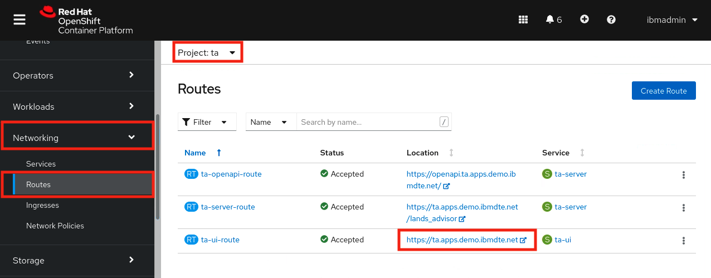

1. This will open the Transformation Advisor user interface. Click **Create new** under **Workspaces** to create a new workspace. 

    

1. Name it **RuntimeModernization** and click **Next**. 

    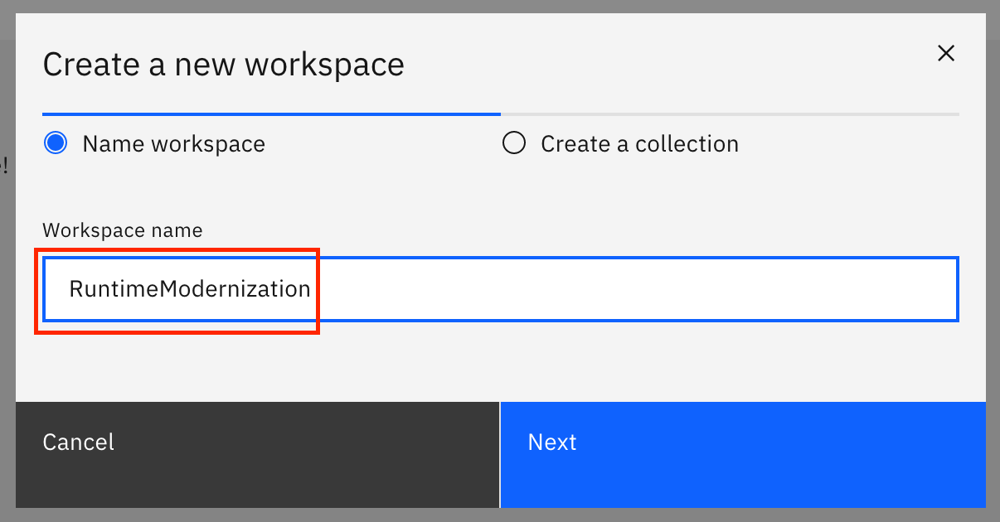
    
    You'll be asked to create a new collection to store the data collected from the **Customer Order Services** application. Name it **CustomerOrderServices**. Click **Create**. 
    
    

1. The **No recommendations available** page is displayed. To provide data and receive recommendations, you can either download and execute the **Data Collector** against an existing WebSphere environment, or upload an existing data collection archive. The archive has already been created for you and the resulting data is stored [here](resources/datacollection.zip). 

    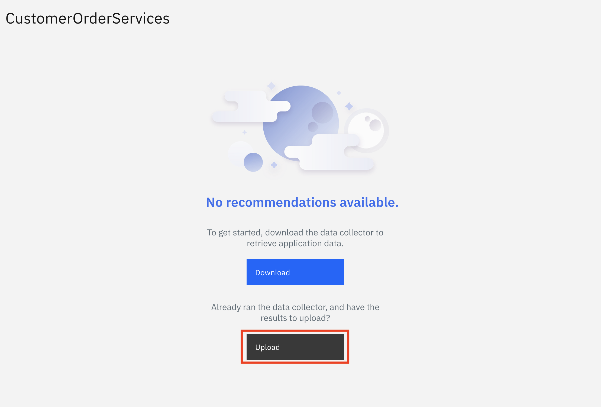
    
    Upload the results of the data collection (the [**datacollector.zip**](resources/datacollection.zip) file) to IBM Cloud Transformation Advisor.
    
    

1. When the upload is complete, you will see a list of applications analyzed from the source environment. At the top of the page, you can see the source environment and the target environment settings.  

    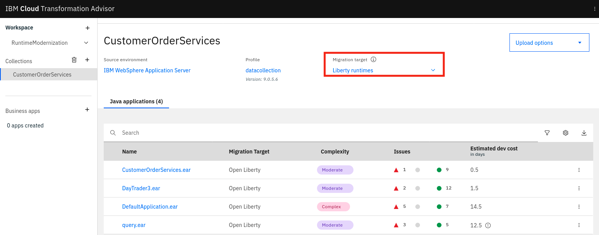
    
    Under the **Migration target** field, click the down arrow and select **Compatible runtimes**. This shows an entry for each application for each compatible destination runtime you can migrate it to.
    
    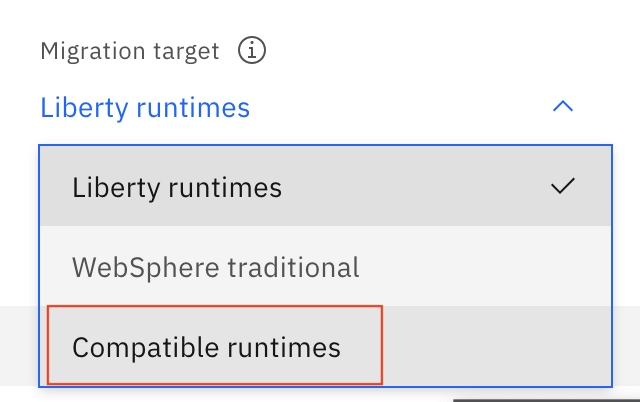

1. Click the **CustomerOrderServicesApp.ear** application with the **Open Liberty** migration target to open the **Application details page**. This lab covers runtime modernization, so the application will be re-platformed to run on Open Liberty, and will be placed in a container and deployed to OCP.

    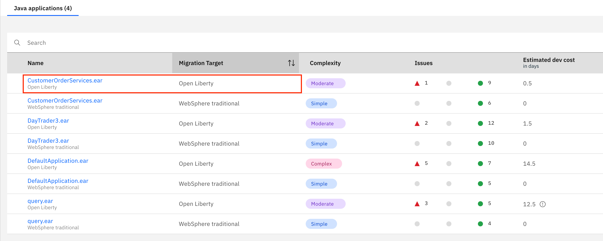
    
1. Look over the migration analysis which shows a summary of the complexity of migrating this application to this target. In summary, migration of this application to Open Liberty is of **Moderate** complexity as some code changes may be required. (Note: there may be a severe issue related to third-party APIs, but this doesn't apply as they occur in test code.)

    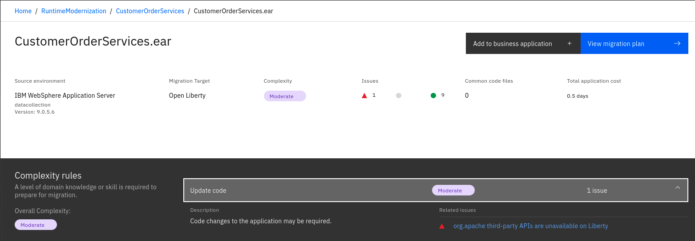


1. Click on **View migration plan** in the top right corner of the page. 
    
    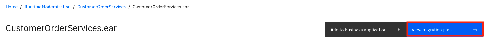
    
    This page will help you assemble an archive containing:
    - your application's source or binary files (you upload these here or specify Maven coordinates to download them)
    - the wsadmin scripts needed to configure your application and its resources (generated by Transformation Advisor and automatically included)
    - the deployment artifacts needed to create the container image and deploy the application to OCP (generated by Transformation Advisor and automatically included)

    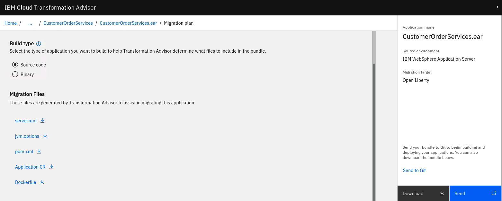

> NOTE: These artifacts have already been provided for you as part of the lab files, so you don't need to download the migration plan. However, you can do so if you wish to look around at the files. These files can also be sent to a Git repository by Transformation Advisor.

<a name="build"></a>
## Build (Hands-on)

In this section, you'll learn how to build a Docker image for Customer Order Services application running on Liberty.

Building this image could take around ~3 minutes so let's kick that process off and then come back to learn what you did.

1. Open a new terminal window from the VM desktop.

    

1. Login to OpenShift CLI with the `oc login` command from the web terminal. When prompted for the username and password, enter the following login credentials:
    - Username: **ibmadmin**
    - Password: **engageibm**
    
      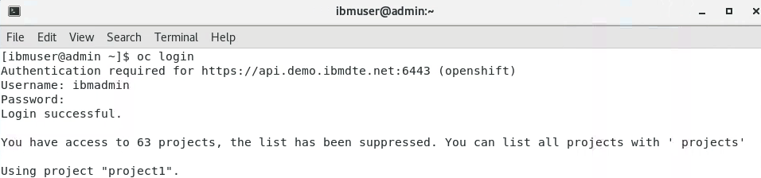

1. If you have not yet cloned the GitHub repo with the lab artifacts, run the following command on your terminal:
    ```
    git clone https://github.com/IBM/openshift-workshop-was.git
    ```
    
1. Change directory to where this lab is located:
   ```
   cd openshift-workshop-was
   cd labs/Openshift/RuntimeModernization
   ls
   ```

1. Run the following command to start building the image. Make sure to copy the entire command, including the `"."` at the end (indicated as the location of current directory). While the image is building (which takes ~3 minutes), continue with rest of the lab:
   ```
   docker build --tag default-route-openshift-image-registry.apps.demo.ibmdte.net/apps/cos .
   ```

## Modernize with MicroProfile (for reading only)
Eclipse MicroProfile is a modular set of technologies designed so that you can write cloud-native microservices. However, even though our application has not been refactored into microservices, we can still take advantage of some of the technologies from MicroProfile.

### Determine application's availability (for reading only)

In the last lab, we used `/CustomerOrderServicesWeb/index.html` for readiness and liveness probes, which is not the best indication that an application is ready to handle traffic or is healthy to process requests correctly within a reasonable amount of time. What if the database is down? What if the application's security layer is not yet ready/unable to handle authentication? The Pod would still be considered ready and healthy and traffic would still be sent to it. All of those requests would fail or queue up, leading to bigger problems.

MicroProfile Health provides a common REST endpoint format to determine whether a microservice (or in our case a monolith application) is healthy or not. The service itself might be running but considered unhealthy if the things it requires for normal operation are unavailable. All of the checks are performed periodically, and the result is served as a simple UP or DOWN at `/health/ready` and `/health/live` which can be used for readiness and liveness probes.

We implemented the following health checks:
- [ReadinessCheck](app/CustomerOrderServicesWeb/src/org/pwte/example/health/ReadinessCheck.java#L17): The application reports it is ready as long as the readiness check endpoint can be reached. Connections to other services and any other required conditions for the application to be considered ready are checked here.

  ```java
  return HealthCheckResponse.named("Readiness").up().build();
  ```

- [LivenessCheck](app/CustomerOrderServicesWeb/src/org/pwte/example/health/LivenessCheck.java#L15): The requests should be processed within a reasonable amount of time. Monitor thread block times to identify potential deadlocks which can cause the application to hang.

    ```java
    ThreadMXBean tBean = ManagementFactory.getThreadMXBean();
    long ids[] = tBean.findMonitorDeadlockedThreads();
    if (ids !=null) {
      ThreadInfo threadInfos[] = tBean.getThreadInfo(ids);
      for (ThreadInfo ti : threadInfos) {
        double seconds = ti.getBlockedTime() / 1000.0;
        if (seconds > 60) {
          return HealthCheckResponse.named("Liveness").down().build();
        }
      }
    }
    return HealthCheckResponse.named("Liveness").up().build();
    ```

### Adding metrics to application (for reading only)

MicroProfile Metrics is used to gather metrics about the time it takes to add an item to cart, retrieve customer information, and count the number of times these operations are performed.

  ```java
  @GET
  @Produces(MediaType.APPLICATION_JSON)
  @Counted
  @Timed(name = "getCustomer_timed")
  public Response getCustomer()
  {
  ```

## Liberty server configuration (for reading only)

The Liberty runtime configuration files are based on a template provided by IBM Cloud Transformation Advisor.  
For this lab, instead of using a single server.xml, the configurations have been split into multiple configuration files and placed into the [config/configDropins/overrides](config/configDropins/overrides) directory.

- You may place configuration files into configDropins/overrides directory to override pre-existing configurations.
- You may define separate template configurations that reflect the resources in your environment, and copy them into the configDropsins/overrides directory only for those applications that need them. 


## Build image (Hands-on)

1. Go back to your terminal to check the build you started earlier.
   You should see the following message if the image was built successfully. Please wait if it's still building:

   ```
   Successfully tagged default-route-openshift-image-registry.apps.demo.ibmdte.net/apps/cos:latest
   ```

1. Validate that the image is in the repository via the command line:

   ```
   docker images
   ```

   - You should see the following images on the output. Notice that the base image, `openliberty/open-liberty`, is also listed. It was pulled as the first step of building application image.

     Example output:
     ```
     REPOSITORY                                                  TAG                     IMAGE ID            CREATED             SIZE
     default-route-openshift-image-registry.apps.demo.ibmdte.net/apps/cos   latest                  4758119add3f        2 minutes ago       883MB
     <none>                                                      <none>                  5bcb83fad548        5 minutes ago       792MB
     openliberty/open-liberty                                    full-java8-openj9-ubi   e6b5411076fe        5 days ago          794MB
     maven                                                       latest                  1337d55397f7        4 weeks ago         631MB
     ```

1. Before we push the image to OpenShift's internal image registry, create a separate project named `apps`.  
   
   Choose one of two ways to create the project:
   
   - Via the command line: 
     ```
     oc new-project apps
     ```   
     
     Example output:
     ```
     Now using project "apps" on server "https://api.demo.ibmdte.net:64
     . . .
     ```
     
   - Via the OpenShift console:
     - Open a Firefox browser window and click on the **openshift console** bookmark.
     - Under the **Home** tab on the left menu, click **Projects**. 
     - Click on the **Create Project** button.

        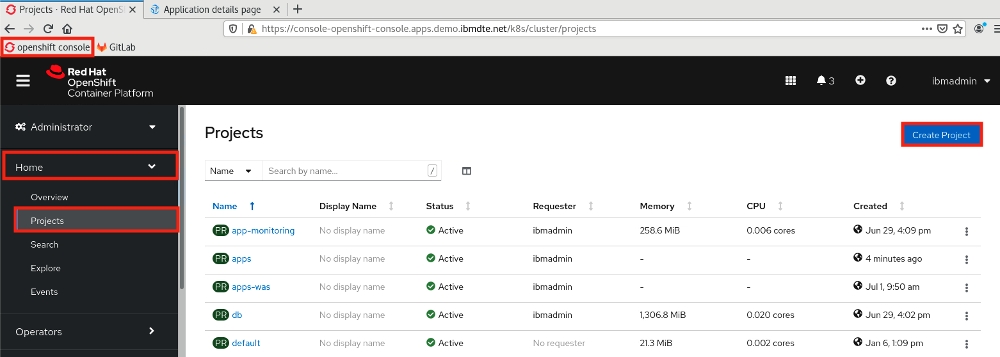

     - Enter `apps` for the _Name_ field and click on **Create**.

        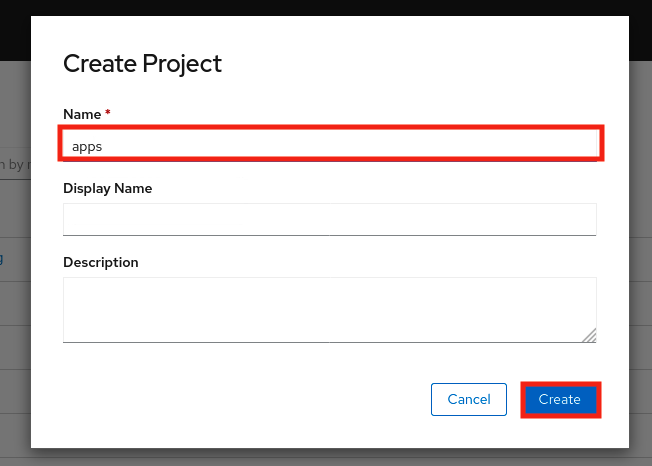

     - Return to your terminal window.
     - Switch the current project in the command line to `apps` 
       ```
       oc project apps
       ```

1. Enable monitoring by adding the necessary label to the `apps` namespace. 

   Choose one of two options to label the namespace:
   
   - Via the command line:
     ```
     oc label namespace apps app-monitoring=true
     ```
     
     Example output:
     ```
     namespace/apps labeled
     ```
     
   - Via the OpenShift console:
     - Under the **Administration** tab on the left menu, click on **Namespaces**.
     - Click on the menu-options for `apps` namespace 
     - Click on **Edit Labels**.
     - Copy and paste `app-monitoring=true` into the text box .
     - Click **Save**.

       


1. Login to the image registry via the command line:
   - Note: From below command, a session token is obtained from the value of another command `oc whoami -t` and used as the password to login.

     ```
     docker login -u openshift -p $(oc whoami -t) default-route-openshift-image-registry.apps.demo.ibmdte.net
     ```
     
     Example output:
     ```
     WARNING! Using --password via the CLI is insecure. Use --password-stdin.
     WARNING! Your password will be stored unencrypted in /root/.docker/config.json.
     Configure a credential helper to remove this warning. See
     https://docs.docker.com/engine/reference/commandline/login/#credentials-store

     Login Succeeded
     ```

1. Push the image to OpenShift's internal image registry via the command line, which could take up to a minute:

   ```
   docker push default-route-openshift-image-registry.apps.demo.ibmdte.net/apps/cos
   ```

   Example output:
   ```
   The push refers to repository [default-route-openshift-image-registry.apps.demo.ibmdte.net/apps/cos]
   9247390b40be: Pushed 
   9a21ca46f8e3: Pushed 
   b3cee8ba43fe: Pushed 
   1dd2f7265f58: Pushed 
   33b2a4ee94ff: Pushed 
   2b2a8abdd0c4: Pushed 
   91ffc437f551: Pushed 
   4f04e7098d96: Pushed 
   248016390e0a: Pushed 
   0fa7eb58a57c: Pushed 
   b5489882eed9: Pushed 
   2fb5caadbbb0: Pushed 
   d06182ac791b: Pushed 
   b39b0291530b: Pushed 
   a04c77af4b60: Pushed 
   479c44e860ff: Pushed 
   fc905c23b8a3: Pushed 
   161ec220381b: Pushed 
   b7b591e3443f: Pushed 
   ccf04fbd6e19: Pushed 
   latest: digest: sha256:56d926b7ef64ed163ff026b7b5608ae97df4630235c1d0443a32a4fc8eb35a6c size: 4513
   ```
   
1. Verify that the image is in image registry via the command line:

   ```
   oc get images | grep apps/cos
   ```

   - The application image you just pushed should be listed.

     Example output:
     ```
     sha256:56d926b7ef64ed163ff026b7b5608ae97df4630235c1d0443a32a4fc8eb35a6c   image-registry.openshift-image-registry.svc:5000/apps/cos@sha256:56d926b7ef64ed163ff026b7b5608ae97df4630235c1d0443a32a4fc8eb35a6c
     ```

1. Verify that the image stream is created via the command line:

   ```
   oc get imagestreams
   ```

   Example output:
   ```
   NAME   IMAGE REPOSITORY                                                       TAGS     UPDATED
   cos    default-route-openshift-image-registry.apps.demo.ibmdte.net/apps/cos   latest   2 minutes ago
   ```

1. You may also check the image stream via the console: 
   - Return to the OpenShift console through your Firefox browser window.
   - Under the **Builds** tab in the left menu, click on **Image Streams**. 
   - Select project `apps` from the **Project** drop-down list. 
   - Click on `cos` from the list. 

      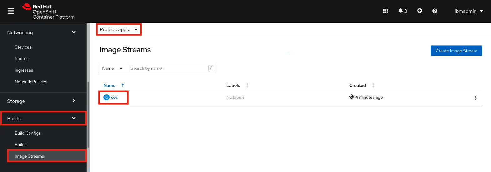

   - Scroll down to the bottom to see the image that you pushed.
   
     


<a name="deploy"></a>
## Deploy (Hands-on)

Customer Order Services application uses DB2 as its database. To deploy it to Liberty, a separate instance of the database is already pre-configured in the OpenShift cluster you are using. The database is exposed within the cluster using a _Service_, and the application references this database using the address of the _Service_.

1. Deploy the application using the `-k`, or `kustomize` option of Openshift CLI now and we will explain how the deployment works in a later section. 
   - Preview what will be deployed:

     ```
     oc kustomize deploy/overlay-apps
     ```

     Example output of yaml:
     ```yaml
     apiVersion: v1
     data:
       DB_HOST: cos-db-liberty.db.svc
     kind: ConfigMap
     metadata:
       name: cos-config
       namespace: apps
     ---
     apiVersion: v1
     data:
       DB_PASSWORD: ZGIyaW5zdDE=
       DB_USER: ZGIyaW5zdDE=
     kind: Secret
     metadata:
       name: db-creds
       namespace: apps
     type: Opaque
     ---
     apiVersion: v1
     kind: Secret
     metadata:
       name: liberty-creds
       namespace: apps
     stringData:
       password: admin
       username: admin
     type: Opaque
     ---
     apiVersion: openliberty.io/v1beta1
     kind: OpenLibertyApplication
     metadata:
       name: cos
       namespace: apps
     spec:
       applicationImage: image-registry.openshift-image-registry.svc:5000/apps/cos
       envFrom:
       - configMapRef:
           name: cos-config
       - secretRef:
           name: db-creds
       expose: true
       livenessProbe:
         httpGet:
           path: /health/live
           port: 9443
           scheme: HTTPS
       monitoring:
         endpoints:
         - basicAuth:
             password:
               key: password
               name: liberty-creds
             username:
               key: username
               name: liberty-creds
           interval: 5s
           scheme: HTTPS
           tlsConfig:
             insecureSkipVerify: true
         labels:
           app-monitoring: "true"
       pullPolicy: Always
       readinessProbe:
         httpGet:
           path: /health/ready
           port: 9443
           scheme: HTTPS
       route:
         insecureEdgeTerminationPolicy: Redirect
         termination: reencrypt
       service:
         annotations:
           service.beta.openshift.io/serving-cert-secret-name: cos-tls
         certificateSecretRef: cos-tls
         port: 9443
     ```
    
   - Run the following command to deploy the yaml files:

     ```
     oc apply -k deploy/overlay-apps
     ```

     Output of deploy command:
     ```
     configmap/cos-config created
     secret/db-creds created
     secret/liberty-creds created
     openlibertyapplication.openliberty.io/cos created
     ```
     
1. Verify that the route is created for your application:
    ```
    oc get route cos
    ```

    Example output:
    ```
    NAME   HOST/PORT                       PATH   SERVICES   PORT       TERMINATION          WILDCARD
    cos    cos-apps.apps.demo.ibmdte.net          cos        9443-tcp   reencrypt/Redirect   None
    ```

1. Verify that your pod from the project `apps` is ready:
   - First, confirm you're at the current project `apps`:
     ```
     oc project
     ```
     
   - If it's not at project `apps`, then switch:
     ```
     oc project apps
     ```
     
   - and then run the following command to view the pod status:
   
      ```
      oc get pod 
      ```

      Example output of pod status:
      ```
      NAME                   READY   STATUS    RESTARTS   AGE
      cos-596b4f849f-2fg4h   1/1     Running   0          18m
      ```
  - If the pod doesn't display the expected `Running` status (for example, after 5 minutes), then delete the pod to restart it.
    From the command line, run `oc delete pod <pod name>`  (pod name is the string under NAME column from the output of `oc get pod`)
    

## Access the application (Hands-on)

1. Run the following command to get the URL of your application:
   ```
   echo http://$(oc get route cos  --template='{{ .spec.host }}')/CustomerOrderServicesWeb
   ```

   Example output:
   ```
   http://cos-apps.apps.demo.ibmdte.net/CustomerOrderServicesWeb
   ```
   
1. Return to your Firefox browser window and go to the URL outputted by the previous command.
   - You'll be shown a login dialog.
   - Login with user `skywalker` and password `force`. (The user is pre-created/registered in the `basicRegistry` configured in Liberty.)

      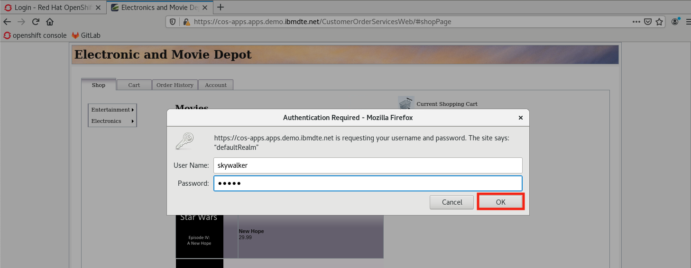

   - After login, the application page titled _Electronic and Movie Depot_ will be displayed.

      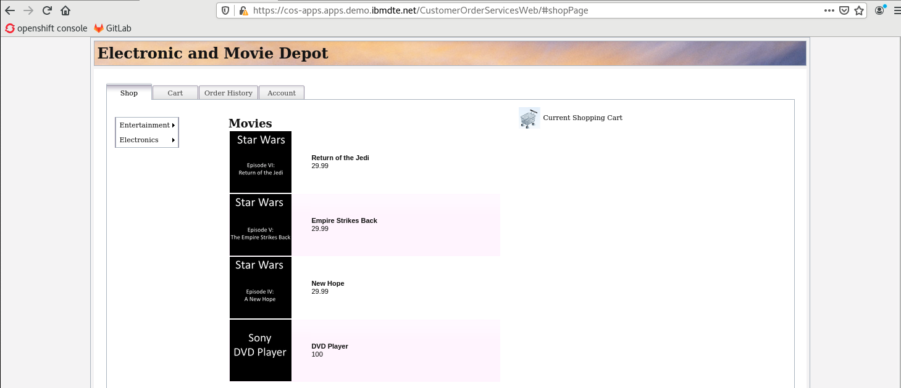

   - From the `Shop` tab, click on an item (a movie) and on the next pop-up panel, drag and drop the item into the shopping cart. 

      

   - Add a few items to the cart. 
   - As the items are added, they’ll be shown under _Current Shopping Cart_ (on the upper right) with _Order Total_.

      
      
   - Close the browser.


## Review the application workload flow with Open Liberty Operator (Hands-on)
1. Return to the OpenShift console through a Firefox window to view the resources on deployment.

1. View the resources in the project `openshift-operators`:
     - Select the `openshift-operators` project from the project drop down menu at the top of the page.
     - View the operator's `deployment` details:
       - Click on the **Deployments** tab under **Workloads** from the left menu and select `open-liberty-operator`
             
         
         
       - Navigate to the `YAML` tab to view the content of yaml
       
         

     - View the operator's `pod` details:
       - Click on the **Pods** tab under **Workloads** from the left menu, and select the pod starting with `open-liberty-operator`
       
         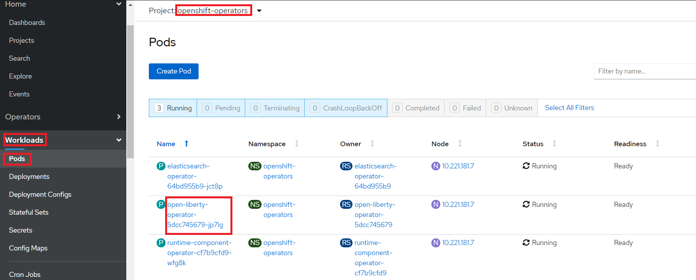
         
       - Navigate to the `Logs` tab to view the `open-liberty-operator` container log
       
         
         
       - Navigate to the `Terminal` tab to view the files in the container
       
            
     
  1. View the resources in the project `apps`:
    
      - Select the `apps` project from the project drop down menu at the top of the page. 
      - View `Open Liberty Application` instance details:
        - Click on the **Installed Operators** tab under **Operators** from the left menu and select `Open Liberty Operator`.  
          > Note: The operator is installed at cluster level and is visible to all existing projects, but Open Liberty Application instance is created under the project `apps`.
    
          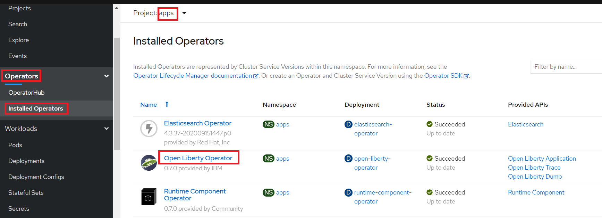
          
        - Navigate to the `Open Liberty Application` tab and select `cos` to view the details of the Open Liberty Application instance
     
          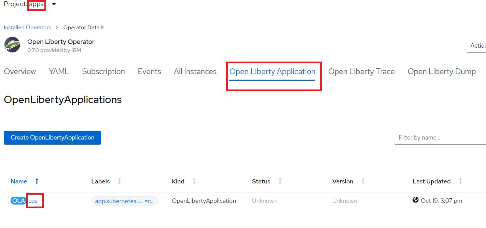
        
        - Navigate to the `YAML` tab to view the content of yaml
        
          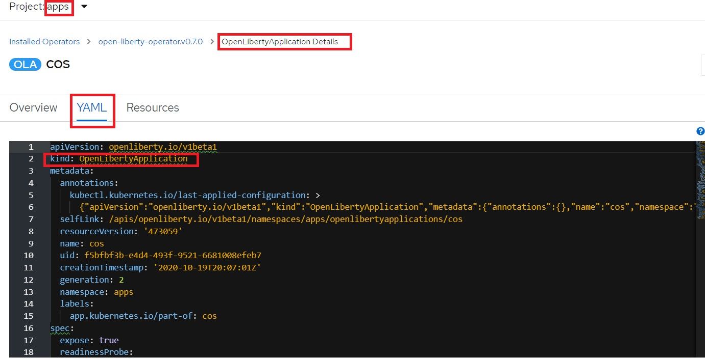
          
        - Navigate to the `Resources` tab to view the resources of Open Liberty Application instance
         
          

      - View application `deployment` details:
        - Click on the **Deployments** tab under **Workloads** from the left menu and select `cos`
        
          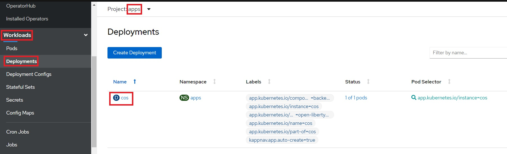

        - Navigate to the `YAML` tab to view the content of yaml.     
          >Note the deployment is created through the controller of the OpenLibertyApplication custom resource.
       
          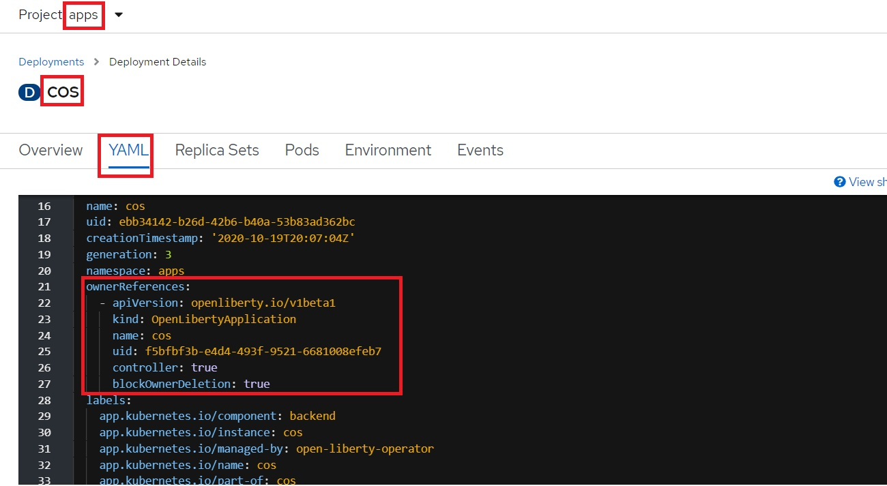
         
      - View application `pod` details:    
        - Click on the **Pods** tab under **Workloads** from the left menu and select the pod starting with `cos-`
       
          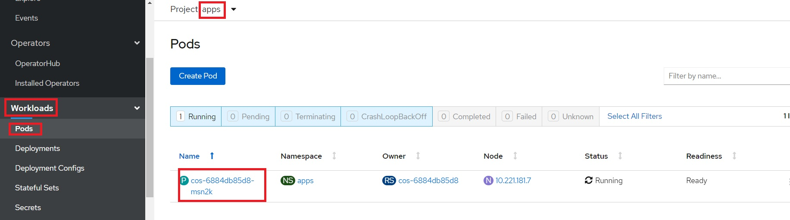  
       
        - Navigate to the `Logs` tab to view the liberty access log
        
                
         
          > Note: by default, the Open Liberty Application instance is configured with liberty access log:
        
          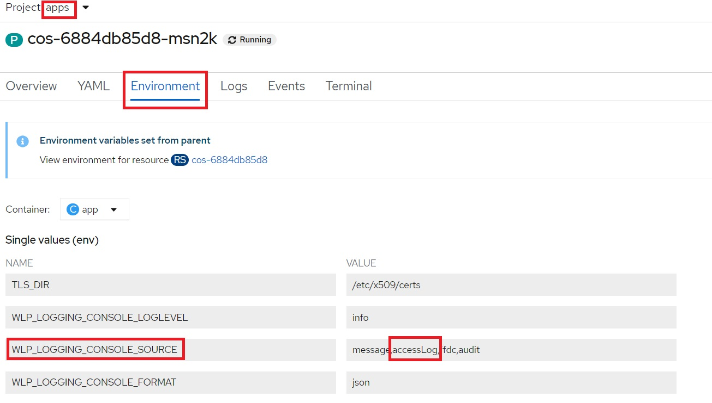
          
          
       - View application `service` details:
       
         - Click on the **Services** tab under **Networking** from the left menu and select `cos`
       
           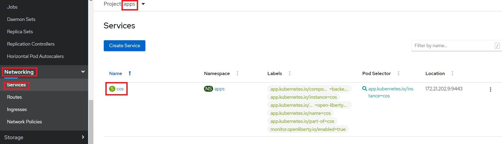 
         
         - Navigate to the `YAML` tab to view the content of yaml.  
            > Note the service is created through the controller of OpenLibertyApplication custom resource.
         
           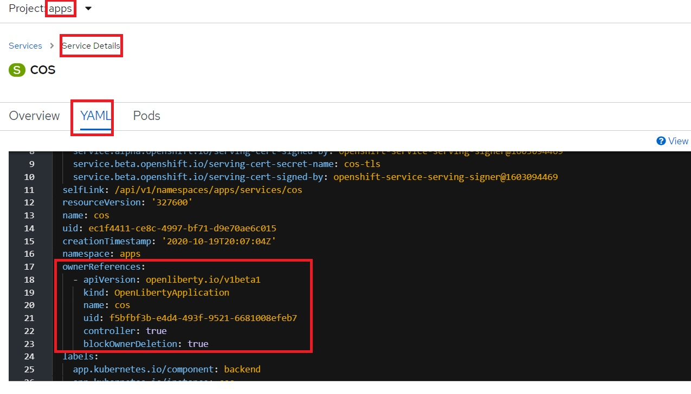   
         
       - View application `route` details:
         - Click on the **Routes** tab under **Networking** from the left menu and select `cos`
       
            
         
         - Navigate to the `YAML` tab to view the content of yaml.  
            >Note the route is created through the controller of OpenLibertyApplication custom resource.
         
              
       
       - View application `secret` details:
         - First, return to the YAML of the Open Liberty Application instance to view the configured secrets:
         
           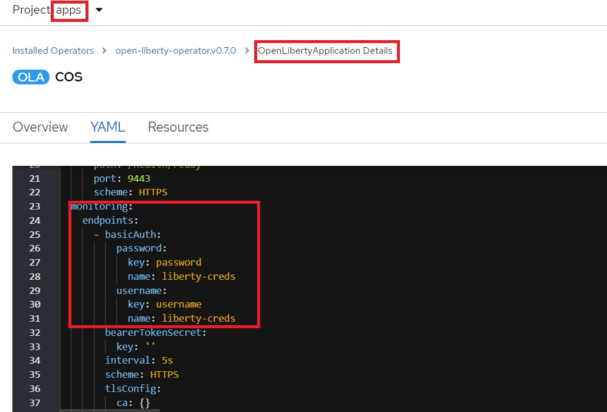 
         
           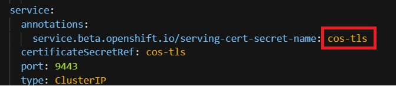 
           
            

         - Click on the **Secrets** tab under **Workloads** from the left menu and select the respective secrets and view the details 
        
           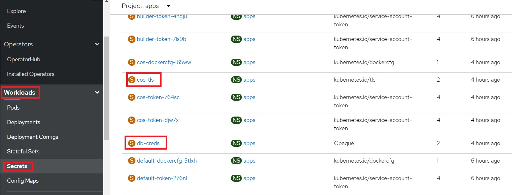 
          
           
           
           
  1. View the resources in the project `db`:
      - Select the `db` project from the project drop down menu.
      - View db `deployment` details:   
        - Click on the **Deployments** tab under **Workloads** from the left menu and select `cos-db-liberty`
       
          

        - Navigate to the `YAML` tab to view the content of yaml
       
          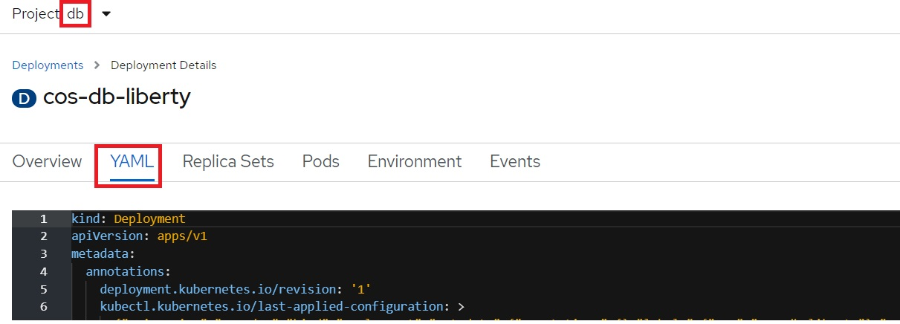
        
      - View db `pod` details:
        - Click on the **Pods** tab under **Workloads** from the left menu and select the pod starting with `cos-db-liberty`
       
          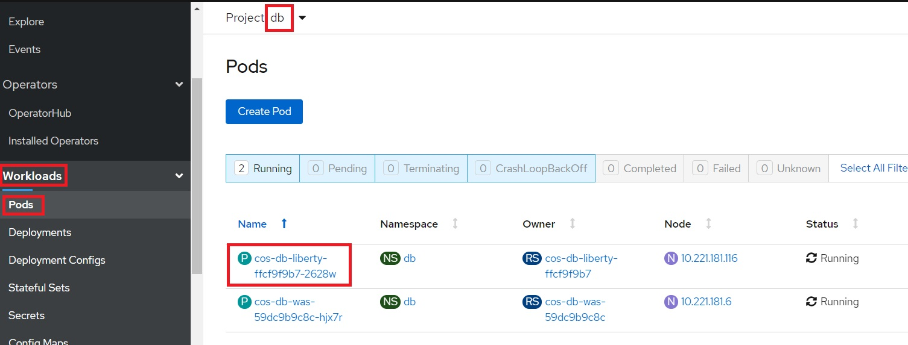
       
        - Navigate to the `Logs` tab to view the database logs
        - Navigate to the `Terminal` tab to view the files in the database container
       
          
        
      - View db `service` details:
        - Click on the **Services** tab under **Networking** from the left menu and select  `cos-db-liberty`
       
          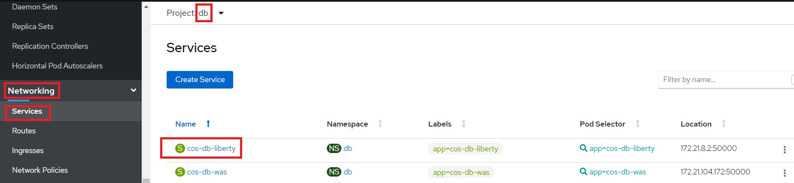

          


## Review Deployment

1. Let's review the configuration files used for our deployment. 
   - Our configuration files are structured for the `-k`, or `kustomize` option of Openshift CLI.
   - Kustomize is a separate tool that has been integrated into Openshift CLI that allows you to customize yaml without using variables.
   - You can define a base directory and  override directories to customize the base directory

1. Make sure you are in directory `/openshift-workshop-was/labs/Openshift/RuntimeModernization` or change directory with 
   ```
   cd openshift-workshop-was/labs/Openshift/RuntimeModernization
   ```
1. List the deploy files:

   ```
   ls deploy 
   ```

   And the output shows that we have one base directory and one override directory:
   
   ```
   base  overlay-apps
   ```

1. Take a look at what's in the `base` directory:
   ```
   ls deploy/base
   ```

   And the output:
   
   ```
   kustomization.yaml  olapp-cos.yaml
   ```

   - Each directory used for kustomization contains one `kustomization.yaml`

     ```
     cat deploy/base/kustomization.yaml
     ```

     Content of yaml:
     - This is a simple kustomization directory that just lists the yaml files to be deployed.
       ```
       resources:
       - olapp-cos.yaml
       ```

   - The file `olapp-cos.yaml` contains the custom resource definition to deploy the application and will be covered in detail later.

1. Take a look at the files in the `overlay-apps` directory. 

   ```
   ls deploy/overlay-apps
   ```

   And the output:
   
   ```
   configmap.yaml  kustomization.yaml  secret-db-creds.yaml  secret-liberty-creds.yaml
   ```
   
   - Take a look at the `kustomization.yaml` in the overlay-apps directory:
     ```
     cat deploy/overlay-apps/kustomization.yaml
     ```

     And the output:

     ```
     namespace: apps
     resources:
     - configmap.yaml
     - secret-db-creds.yaml
     - secret-liberty-creds.yaml
     bases:
     - ./../base
     ```

    Note that:
    - The namespace is defined. This means that all resources originating from this directory will be applied to the `apps` namespace.
    - Resources from the base directory will also be included.
    - You may define additional overlay directories for different environments, each with a different namespace. For example, overlay-test, overlay-prod.
    - The configurations in this directory contain the overrides specific to this environment. 
    - For a real environment, DO NOT store the secret yamls into source control. It is a security expsoure.  See extra credit section on how to secure your secrets.

   - To preview the resources that will be applied for a specific override directory, use the `kustomize` option of the Openshift command line. For example,

     ```
     oc kustomize deploy/overlay-apps
     ```
     The output is the same as displayed in [Deploy](#deploy) (Hands-on) section.
     
     
## Secrets

Specifying credentials and tokens in plain text is not secure. 
`Secrets` are used to store sensitive information. 
The stored data can be referenced by other resources. OpenShift handles secrets with special care. For example, they will not be logged or shown anywhere. 

There are two secrets - one for database credentials and one for Liberty metrics credentials, which is needed to access the `/metrics` endpoint.


- The file `secret-db-creds.yaml` contains the credentials for the database.  It is injected into the container as an environment variable via the `secretRef` specification for the Open Liberty Operator.

  View the content of `secret-db-creds.yaml` file:
  ```
  cat deploy/overlay-apps/secret-db-creds.yaml
  ```
  Example output:
  ```
  kind: Secret
  apiVersion: v1
  metadata:
    name: db-creds
  data:
    DB_PASSWORD: ZGIyaW5zdDE=
    DB_USER: ZGIyaW5zdDE=
  type: Opaque
  ```

- The file `secret-liberty-creds.yaml` contains the secret to access liberty server.

  View the content of `secret-liberty-creds.yaml` file: 
  ```
  cat deploy/overlay-apps/secret-liberty-creds.yaml
  ```
  Example output:
  ```
  kind: Secret
  apiVersion: v1
  metadata:
    name: liberty-creds
  stringData:
    username: admin
    password: admin
  type: Opaque
  ```

Note that the first `Secret` provides the credentials in base64 encoded format using the `data` field. The second one provides them in plain text using the `stringData` field. OpenShift will automatically convert the credentials to base64 format and place the information under the `data` field. We can see this by viewing the YAML of the `liberty-creds` secret:

- Return to the OpenShift console through a Firefox browser window.
- Select the `apps` project from the project drop down menu.
- Click on the **Secrets** tab under **Workloads** from the left menu and search for the `liberty-creds` secret.

  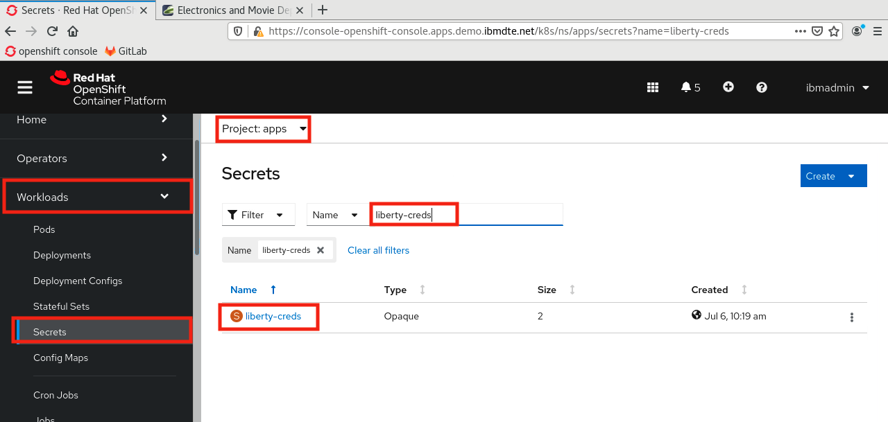

- Navigate to the `YAML` tab. Note that the `data` field contains the credentials in encoded form.

  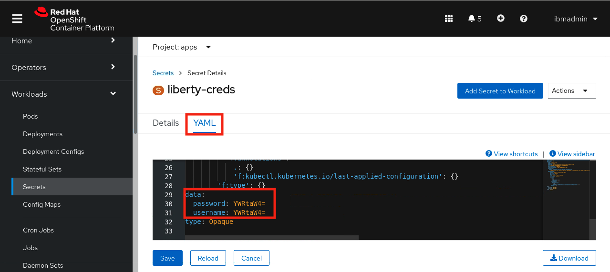

## Configmap

Configmaps allows you to store name/value pairs that can be injected into your container when it starts.
For our example, the values of the `configmap.yaml` are injected as environment variables  in the `configMapRef` specification on the _Open Liberty Operator_ in the next section.

```
cat deploy/overlay-apps/configmap.yaml
```
Example output:
```
apiVersion: v1
kind: ConfigMap
metadata:
  name: cos-config
data:
  SEC_TLS_TRUSTDEFAULTCERTS: "true"
  DB_HOST : "cos-db-liberty.db.svc"
```

## Open Liberty Operator

We could have created Deployment, Service, and Route resources to deploy the Liberty image. 
However, for this lab we will use the Open Liberty Operator instead. 
The Open Liberty Operator provides all functionalities of Runtime Component Operator used when deploying traditional WebSphere images in a previous lab. 
In addition, it also offers Open Liberty specific capabilities, such as day-2 operations (gather trace & dumps) and single sign-on (SSO).

The file `deploy/base/olapp-cos.yaml` looks like:

```yaml
apiVersion: openliberty.io/v1beta1
kind: OpenLibertyApplication
metadata:
  name: cos
  namespace: apps
spec:
  applicationImage: 'image-registry.openshift-image-registry.svc:5000/apps/cos'
  pullPolicy: Always
  readinessProbe:
    httpGet:
      path: /health/ready
      port: 9443
      scheme: HTTPS
  livenessProbe:
    httpGet:
      path: /health/live
      port: 9443
      scheme: HTTPS
  service:
    annotations:
      service.beta.openshift.io/serving-cert-secret-name: cos-tls
    certificateSecretRef: cos-tls
    port: 9443
  expose: true
  route:
    termination: reencrypt
    insecureEdgeTerminationPolicy: Redirect
  env:
  envFrom:
  - configMapRef:
      name: cos-config
  - secretRef:
      name: db-creds
  monitoring:
    endpoints:
      - basicAuth:
          password:
            key: password
            name: liberty-creds
          username:
            key: username
            name: liberty-creds
        interval: 5s
        scheme: HTTPS
        tlsConfig:
          insecureSkipVerify: true
    labels:
      app-monitoring: 'true'
```

- The `OpenLibertyApplication` is a custom resource supported by the Open Liberty Operator, which is designed to help you with Liberty deployment. It allows you to provide Liberty specific configurations (day-2 operations, single sign-on).

- The application image you pushed earlier to internal image registry is specified by the `applicationImage` parameter.

- MicroProfile Health endpoints `/health/ready` and `/health/live` are used for readiness and liveness probes.

- The `configMapRef` surfaces all entries of the  ConfigMap `cos-config`  as environment variables.

- The `secretRef` surfaces the entries in the Secret `db-creds` as environment variables. These are the database user and password.

- Enabled application monitoring so that Prometheus can scrape the information provided by MicroProfile Metric's `/metrics` endpoint in Liberty. The `/metrics` endpoint is protected, hence the credentials are provided using the _Secret_ `liberty-creds` you created earlier.

## Cleanup (Hands-on) (Skip this step if you're going to run the next lab [Application Management](https://github.com/IBM/openshift-workshop-was/tree/operational/labs/Openshift/ApplicationManagement) on the same assigned cluster)

1. The controller for the Open Liberty Operator creates the necessary Deployment, Service, and Route objects for the Customer Order Services application. To list these resources, run the commands:

   > Reminder: Run `oc project` to confirm you're at the `apps` project before running the following commands.
   
   ```
   oc get deployment
   oc get service
   oc get route
   ```
   
   Example output:
   ```
   # oc get deployment
   NAME   READY   UP-TO-DATE   AVAILABLE   AGE
   cos    1/1     1            1           2d18h

   # oc get service
   NAME   TYPE        CLUSTER-IP     EXTERNAL-IP   PORT(S)    AGE
   cos    ClusterIP   172.21.202.9   <none>        9443/TCP   2d18h

   # oc get route
   NAME   HOST/PORT                        PATH   SERVICES   PORT       TERMINATION          WILDCARD
   cos    cos-apps.apps.demo.ibmdte.net           cos        9443-tcp   reencrypt/Redirect   None
   ```

1. To remove these resources, run the command (Ensure you are in directory `openshift-workshop-was/labs/Openshift/RuntimeModernization`)
   
   > Note: The pre-installed resources such as Open Liberty Operator and DB2, are not removed.
   
   ```
   oc delete -k deploy/overlay-apps
   ```

   Output:
   ```
   configmap "cos-config" deleted
   secret "db-creds" deleted
   secret "liberty-creds" deleted
   openlibertyapplication.openliberty.io "cos" deleted
   ```
   
   Double check the corresponding Deployment, Service, and Route objects are deleted:

   ```
   oc get deployment
   oc get service
   oc get route
   ```
   
   Output from each `get` command above:
   ```
   No resources found in apps namespace.
   ```

## Extra Credit

- Read about how to protect your secrets: https://www.openshift.com/blog/gitops-secret-management

## Summary

Congratulations! You've completed **Runtime Modernization** lab! This application has been modified from the initial WebSphere ND v8.5.5 version to run on modern & cloud-native runtime Open Liberty and deployed by IBM Cloud Pak for Applications to RedHat OpenShift.


## Next
Follow the link to the next lab **Application Management**:
- [Application Management](../ApplicationManagement)

